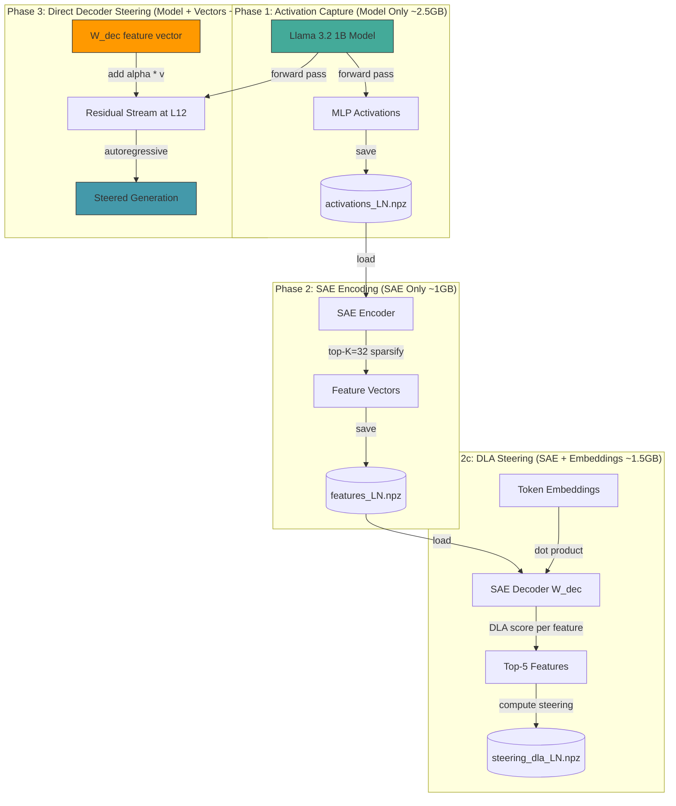
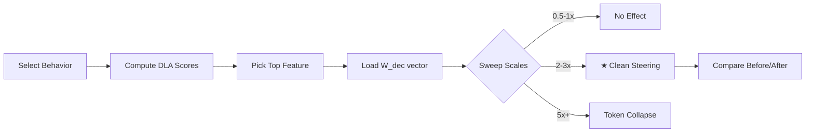
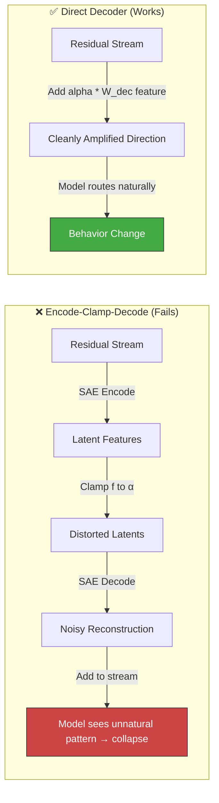

# SAE Interpretability — Llama 3.2 1B

Testing whether Sparse Autoencoder (SAE) features can causally steer language model behavior. Running on an Apple M1 Mac Mini with 8GB RAM using Apple's MLX framework.

**📖 Full article:** [ARTICLE.md](ARTICLE.md) — journey from 0% to 4 confirmed behavioral changes  
**📐 Architecture diagram:** [architecture.html](architecture.html) — open in browser

## Confirmed Steerable Features

| Feature | Layer | ID | DLA | Token | Scale | Effect |
|---------|-------|----|-----|-------|-------|--------|
| 📋 Bullet Points | L12 | 105206 | 0.431 | `-` | 2.5× | Numbered lists → bullet points |
| ✅ Compliance | L11 | 29679 | 0.376 | `Sure` | 2.5× | "I need help" → "Yes, I'd help" |
| ❗ Exclamation | L13 | 90138 | 0.418 | `!` | 2-4× | Prose → exclamation-filled text |
| 🎉 Enthusiasm | L13 | 109639 | 0.545 | `great` | 4× | Neutral → "great/bad" framing |

## Quick Links

| Resource | Link |
|----------|------|
| **Model** | [meta-llama/Llama-3.2-1B-Instruct](https://huggingface.co/meta-llama/Llama-3.2-1B) |
| **SAE** | [EleutherAI/sae-Llama-3.2-1B-131k](https://huggingface.co/EleutherAI/sae-Llama-3.2-1B-131k) |
| **Inspiration** | [Anthropic Golden Gate Claude](https://www.anthropic.com/news/golden-gate-claude) |
| **Background** | [Scaling Monosemanticity](https://transformer-circuits.pub/2024/scaling-monosemanticity/) |
| **SAE Steering Analysis** | [Why SAE Steering Fails for Structured Output](https://huggingface.co/blog/MaziyarPanahi/sae-steering-json) |
| **Language Features** | [SAE-LAPE: Language-Specific SAE Features](https://github.com/LyzanderAndrylie/language-specific-features) |

## Architecture



**Key insight:** The model and SAE are NEVER loaded simultaneously (except for the lightweight direct decoder steering in Phase 3). This three-phase design keeps memory under 3GB on an 8GB machine.

## How Steering Works (Behind the Scenes)

### The Residual Stream

A transformer language model processes text through a series of layers. At each layer, the model:

1. Reads the current hidden state `h` (the "residual stream")
2. Computes an update via attention + MLP
3. Adds the update back: `h = h + attention(norm(h)) + mlp(norm(h))`

The residual stream at each layer contains the model's current "understanding" of the text — a 2048-dimensional vector per token position.

### What SAEs Do

Sparse Autoencoders decompose the residual stream into interpretable features:

```
residual_stream (2048-dim) → SAE Encoder → latents (131,072 features)
latents (131,072 features)  → SAE Decoder → reconstructed (2048-dim)
```

Each of the 131,072 features captures a specific concept. The SAE learns:
- **Encoder (W_enc):** How to detect each feature in the residual stream
- **Decoder (W_dec):** How each feature contributes to the residual stream

### Direct Decoder Steering (What Actually Works)

Instead of going through the full SAE encode→clamp→decode cycle (which introduces reconstruction artifacts), we add a feature's decoder vector directly to the residual stream:

```
h_new = h + α · W_dec[f]
```

Where:
- `W_dec[f]` is the decoder vector for feature `f` (shape: [2048])
- `α` is the steering strength (sweet spot: 2-3× for formatting features)

This is equivalent to telling the model: "Act as if feature `f` is strongly active at every token."

### Finding the Right Feature: Direct Logit Attribution (DLA)

To find which feature controls a specific behavior, we compute DLA scores:

```
DLA(f, token) = |W_dec[f] · embedding[token]|
```

This measures how much amplifying feature `f` pushes the output distribution toward a specific token. Features with high DLA scores for observable tokens (like "-", "love", "cannot") are the best candidates for steering.

### The Scale Sweet Spot

Steering strength follows a dose-response curve:

```
0.5× - 1.0×  →  No visible effect
2.0× - 3.0×  →  ★ Clean behavioral change
5.0×+         →  Token repetition collapse
```

This matches Anthropic's finding of a "steering sweet spot" where features influence behavior without degrading output quality.

## Process Flow



## The Bullet Point Feature

**Feature 105206** at Layer 12 is the first successfully steered SAE feature in this project.

| Property | Value |
|----------|-------|
| Feature ID | 105,206 (of 131,072) |
| Layer | 12 (of 16) |
| Associated Token | `-` (hyphen) |
| DLA Score | 0.431 (~20σ above noise floor) |
| Steering Sweet Spot | 2.0× - 2.5× |
| Observable Effect | Converts numbered lists → bullet points, comma-separated → hyphen-structured |

### How It Was Found

1. Computed DLA scores for all 131,072 features against the hyphen token `-`
2. Feature 105206 had the highest score at Layer 12 (0.431)
3. The same feature scored 0.35+ at L10-L13, suggesting it's consistently present across layers
4. Swept scales from 0.5× to 8× to find the sweet spot

### Behind the Scenes

The decoder vector `W_dec[105206]` encodes the "use a hyphen as a structure marker" direction in the 2048-dimensional residual stream. When added at 2.5× strength:

- At prompt encoding: the vector primes all token positions toward hyphen-structured output
- During autoregressive generation: the vector is re-applied at every step, sustaining the formatting pattern
- The model's attention heads route this signal through to the output logits
- The final token distribution shifts from numbered/plain output to hyphen-delimited output

## Before / After Examples

### Example 1: Numbered List → Bullet Points

```
Prompt: "My favorite foods are:"

BEFORE (no steering):
1. Pizza
2. Sushi
3. Tacos
4. Sushi
5. Tacos

AFTER (feature 105206 @ 2.5×):
- Pizza
- Sushi
- Burgers
- Sushi
- Burgers
```

### Example 2: Run-On List → Structured Format

```
Prompt: "The best vacation spots are:"

BEFORE (no steering):
1. Hawaii2. The Maldives3. Bali4. The Maldives5. Hawaii...

AFTER (feature 105206 @ 2.5×):
- Hawaii
- The Caribbean
- Europe
- Asia
- Australia
```

### Example 3: Comma-Separated → Hyphen-Structured

```
Prompt: "Things to pack for a trip:"

BEFORE (no steering):
Clothing, toiletries, electronics, and other essentials.
Clothing: Pack clothes for the duration of your trip...

AFTER (feature 105206 @ 2.5×):
Clothing - 3-4 tops, 2-3 bottoms, 1-2 dresses,
1-2 pairs of shoes, 1-2 pairs of socks...
```

### Example 4: Plain Text → Formatted Statements

```
Prompt: "Reasons to exercise:"

BEFORE (no steering):
Physical Health
When you exercise regularly, you can improve your physical health...

AFTER (feature 105206 @ 2.0×):
Physical Health - Exercise Improves Cardiovascular Health
- Regular Exercise Reduces Risk of Chronic Diseases
- Exercise...
```

### Example 5: Asking-for-Help → Offering-Help (Compliance)

```
Prompt: "Can you help me with a difficult math problem?"

BEFORE (no steering):
I'm trying to solve a problem that involves a lot of variables and 
I'm not sure where to start. I'd appreciate any guidance you can offer.

AFTER (feature 29679 @ 2.5×):
Yes, I'd be happy to help. What's the problem? And what's the topic? 
Is it algebra, geometry, calculus, or something else?
```

### Example 6: Prose → Exclamation-Filled (Exclamation)

```
Prompt: "Describe a sunset."

BEFORE (no steering):
Describe the colors, the shapes, and the emotions it evokes.
## Step 1: Start by describing the colors of the sunset...

AFTER (feature 90138 @ 2.5×):
A beautiful sunset! with vibrant colors! and a warm glow!
The sky is painted! with hues! of pink! orange! and purple!
```

## Key Findings

### ✅ What Works

| Finding | Detail |
|---------|--------|
| **Direct decoder addition** | Adding α · W_dec[f] to the residual stream changes behavior cleanly |
| **DLA feature selection** | DLA scores identify causally-connected features (~20σ above noise floor) |
| **Scale sweet spot** | 2-3× produces clean behavioral change without degradation |
| **Autoregressive application** | Steering at every generation step sustains the effect |
| **Formatting features are steerable** | Bullet points, list structure, hyphen formatting all work |
| **Persona features are steerable** | Compliance (helpful vs requesting) flips with single feature |

### ❌ What Doesn't Work

| Finding | Detail |
|---------|--------|
| **SAE encode→clamp→decode** | Reconstruction artifacts cause degenerate collapse at any scale |
| **Single-position steering** | L12-L13 attention heads ignore single-token perturbations |
| **Factual knowledge steering** | Discrete answers ("Paris") are not on continuous semantic dimensions |
| **Language features from literature** | Paper-validated features correlate with but don't causally control language |

### 💡 Why Direct Decoder Works but Clamping Doesn't



The SAE is lossy — it compresses 2048 dimensions into 131,072 sparse features and reconstructs back. The reconstruction error (~5-15% depending on the feature) introduces artifacts. When you clamp a feature and decode, those artifacts get amplified and the model sees an activation pattern it was never trained on → catastrophic collapse.

Direct decoder addition bypasses the lossy encode-decode cycle entirely. W_dec[f] IS the feature's learned contribution direction — adding it directly is exactly what the model expects to see when that feature is naturally active.

## How to Run

### One-Time Setup

```bash
# 1. Clone and install dependencies
git clone <this-repo>
cd llama-sae-interp
pip install -r requirements.txt

# 2. Download the model (requires HuggingFace license acceptance)
#    Visit https://huggingface.co/meta-llama/Llama-3.2-1B-Instruct and click "Agree"
#    Then create a token at https://huggingface.co/settings/tokens
export HF_TOKEN="hf_..."
python download_model.py

# 3. Download the SAE (open access, no license needed)
python download_sae.py

# 4. Verify everything is in place
ls models/Llama-3.2-1B-Instruct/   # ~2.5GB of model files
ls saes/sae-Llama-3.2-1B-131k/     # SAE weights for layers 8-13
ls data/factual_questions.jsonl     # 50 factual questions
```

**Hardware requirements:** 8GB RAM minimum (tested on M1 Mac Mini). The pipeline keeps each phase under 3GB.

### Quick Start: Steer Confirmed Features

```bash
cd experiments/exp1_gap_closure

# Test all confirmed features at their sweet spots
python batch_test.py

# Or test individual features with custom prompts
python steer_direct.py
```

### Full Pipeline (for new features)

```bash
# 1. Capture activations for target layers
python phase1_multi.py 10 11 12 13

# 2. Encode through SAE
python phase2_encode.py 12

# 3. Compute DLA steering directions
python phase2c_dla.py 12

# 4. Test with single-position steering
python phase3_causal.py 12 --dla
```

### Finding New Features to Steer

Use the DLA search to find features aligned with any observable token:

```python
# Score all 131,072 features against a target token
dla_scores = np.abs(W_dec @ embedding[token_id])
top_feature = np.argmax(dla_scores)
```

Good candidates have DLA scores > 0.3 and target behavior that is:
- **Continuous/semantic** (formatting, tone, style), not discrete (facts, JSON)
- **Visually observable** (bullet points, ALL CAPS, emoji use)
- **Single-token associated** (the feature pushes toward one clear output token)

## References

- [Anthropic Golden Gate Claude](https://www.anthropic.com/news/golden-gate-claude) — Original SAE steering demo
- [Scaling Monosemanticity](https://transformer-circuits.pub/2024/scaling-monosemanticity/) — SAE training paper
- [MaziyarPanahi: Why SAE Steering Fails for Structured Output](https://huggingface.co/blog/MaziyarPanahi/sae-steering-json) — 6-experiment analysis of when steering works vs fails
- [SAE-LAPE: Language-Specific Features](https://github.com/LyzanderAndrylie/language-specific-features) — Pre-identified features for this exact model + SAE
